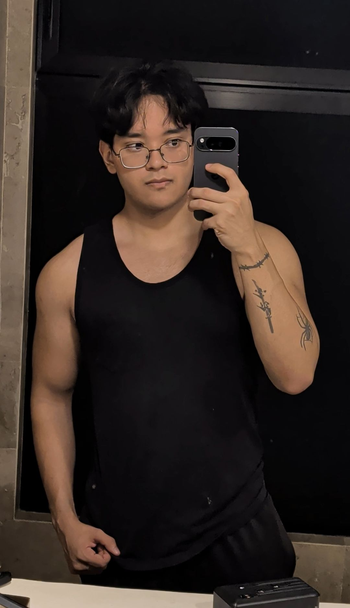

## Reflexión individual

**Tus intereses y experiencias previas relacionadas con videojuegos o desarrollo.**

Juego videojuegos desde niño y de varios tipos, como acción, aventura, RPG, gacha, shooters, plataformas, simulación, deportes y terror, entre otros. Así que puedo decir que me gustan mucho los videojuegos y tengo experiencia jugando diferentes géneros.

**¿Qué significa para ti “diseñar un videojuego” en este momento?**

Para mí, diseñar un videojuego significa poder utilizar mi creatividad para crear un producto que entretenga a las personas y que puedan disfrutar al utilizarlo.

**Cómo te imaginas tu rol como diseñador durante el curso.**

Principalmente, me imagino diseñando la jugabilidad y siendo uno de los principales integrantes del equipo que priorice la experiencia del usuario.
